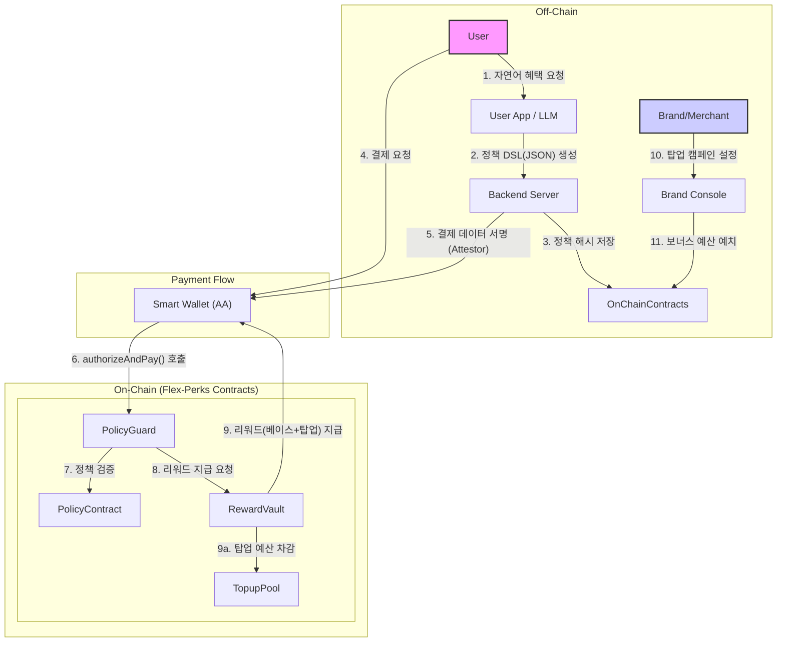

# Flex-Perks: On-Chain Programmable Card Benefits

Flex-Perks는 사용자가 직접 자신의 신용/체크카드 혜택을 설계하고, 이를 온체인 스마트 컨트랙트를 통해 강제하는 프로그래머블 혜택 카드 플랫폼입니다. LLM을 활용해 자연어 요청을 온체인 정책으로 변환하고, 결제 시점에 실시간으로 혜택을 적용하여 즉시 캐시백을 지급합니다.

**핵심 가치:**
- **사용자:** 고정된 혜택에서 벗어나 자신의 소비 패턴에 맞는 혜택을 직접 설계합니다.
- **가맹점/브랜드:** 시간, 위치, 카테고리별로 정밀 타겟팅된 보너스(탑업)를 집행하여 마케팅 효율을 극대화합니다.
- **플랫폼:** 온체인 정책 강제를 통해 분쟁 및 운영 비용을 줄이고, 브랜드 탑업 마켓을 통해 새로운 수익 모델을 창출합니다.

---

## 🏛️ 아키텍처

Flex-Perks는 오프체인과 온체인 시스템이 결합된 하이브리드 모델로 동작합니다. 사용자의 자연어 요청 처리 및 결제 데이터 생성은 오프체인에서, 정책의 저장과 강제, 리워드 지급은 온체인에서 투명하게 처리됩니다.



**주요 흐름:**
1.  **정책 생성 (Off-chain):** 사용자가 앱에서 자연어로 원하는 혜택(예: "커피 대신 베이커리 20% 할인")을 요청합니다.
2.  **LLM 컴파일 (Off-chain):** LLM이 사용자의 요청을 분석하여 정책(Policy) DSL(JSON 형식)으로 변환합니다.
3.  **정책 저장 (On-chain):** 백엔드 서버가 생성된 정책의 해시(Hash)를 `PolicyContract`에 저장하여 위변조를 방지합니다.
4.  **결제 및 검증 (On-chain):**
    -   사용자가 결제를 요청하면, 백엔드의 Attestor가 시간, 위치, 카테고리 등 결제 데이터를 서명합니다.
    -   사용자의 스마트 월렛(AA)은 이 서명과 함께 `PolicyGuard` 컨트랙트의 `authorizeAndPay` 함수를 호출합니다.
    -   `PolicyGuard`는 `PolicyContract`에 저장된 정책 해시와 결제 데이터를 대조하여 혜택 적용 여부를 검증합니다.
5.  **리워드 지급 (On-chain):**
    -   검증을 통과하면 `PolicyGuard`가 `RewardVault`를 호출합니다.
    -   `RewardVault`는 플랫폼이 제공하는 기본 캐시백과 브랜드가 `TopupPool`에 예치한 보너스 캐시백을 합산하여 사용자에게 즉시 지급합니다.

---

## 📦 스마트 컨트랙트 구성

이 저장소는 Flex-Perks의 핵심 로직을 담당하는 온체인 스마트 컨트랙트의 MVP(Minimum Viable Product) 버전을 포함합니다.

### 현재 구현된 컨트랙트

-   **`PolicyContract.sol`**: 사용자의 혜택 정책 해시를 저장하고 관리합니다. 아이디어 문서의 `PolicyStore`에 해당하는 MVP 버전입니다. 신뢰할 수 있는 백엔드 서버만이 정책을 등록/수정할 수 있습니다.
-   **`BenefitRegistry.sol`**: 플랫폼에서 지원하는 혜택 카테고리 코드를 관리하는 레지스트리 컨트랙트입니다. 관리자(Admin)만이 카테고리를 추가하거나 삭제할 수 있습니다.

### 향후 구현될 컨트랙트

-   **`PolicyGuard`**: 결제 시점에 정책을 검증하고 리워드 지급을 트리거하는 핵심 로직을 담당합니다.
-   **`RewardVault`**: 사용자에 대한 기본 캐시백 및 브랜드 탑업 보너스를 즉시 지급합니다.
-   **`TopupPool`**: 브랜드/가맹점이 특정 조건(시간, 위치, 카테고리)에 맞춰 보너스 예산을 예치하고 관리하는 컨트랙트입니다.
-   **`MerchantRegistry`**: 탈중앙화된 방식으로 가맹점을 등록하고, 보증금 기반으로 시스템의 신뢰도를 유지합니다.

---

## 🚀 시작하기

### 사전 준비

-   [Foundry](https://getfoundry.sh/) 개발 환경이 필요합니다.
-   프로젝트 루트에 `config.toml` 파일을 생성해야 합니다. `config.example.toml` 파일을 복사하여 사용하세요.
    ```bash
    cp config.example.toml config.toml
    ```
-   `config.toml` 파일에 Baobab 테스트넷 또는 Cypress 메인넷의 RPC URL, Private Key, Etherscan API Key를 입력합니다.

### 설치 및 빌드

```bash
# 의존성 설치
make install

# 컨트랙트 빌드
make build
```

### 테스트

```bash
# 테스트 실행
make test
```

### 배포

```bash
# Kaia 테스트넷(Baobab)에 배포
make deploy-testnet

# Kaia 메인넷(Cypress)에 배포
make deploy-mainnet
```

---

## 📁 디렉토리 구조

```
.
├── src/                    # 스마트 컨트랙트 소스 코드
│   ├── PolicyContract.sol  # 사용자별 정책 해시 저장 컨트랙트
│   └── BenefitRegistry.sol # 혜택 카테고리 관리 컨트랙트
├── script/                 # 배포 스크립트
│   └── Deploy.s.sol
├── config.example.toml     # 배포 및 네트워크 설정 예시 파일
├── Makefile                # 빌드, 테스트, 배포 등 자동화 스크립트
└── README.md               # 프로젝트 소개 문서
```
